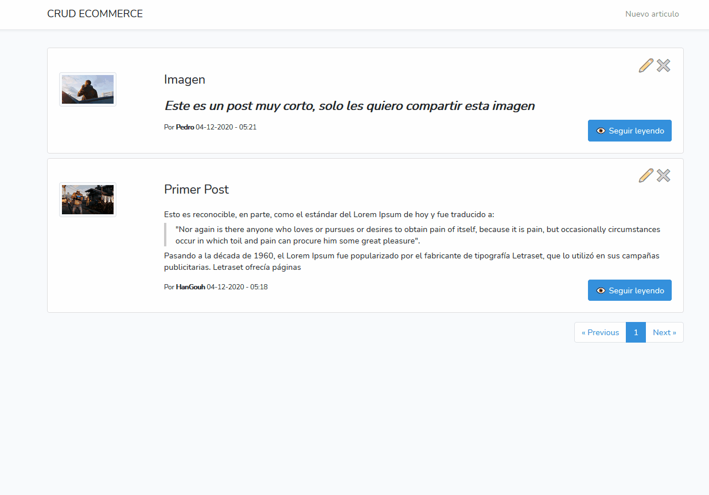

# CRUD ECOMMERCE

## Tabla de contenido

* [Requerimientos y herramientas](#requerimientos-y-herramientas)
* [Como instalar](#como-instalar)
* [Usar](#usar)
* [Demo](#demo)
* [Licencia](#licencia)

## Requerimientos y herramientas

* Laravel Framework 8.11.2
* PHP 7.4.11
* Node.js v12.16.3

## Como instalar

* Para instalar paquetes necesarios de composer para laravel
```
$ composer i
```

* Para instalar modules necesarios de node
```
$ npm i
```

## Usar
#### Cabe resaltar que todo debe ser sobre la raiz del proyecto
* Antes de ejecutar cualquier comando te recomiendo que crees la base de datos con el nombre:
```
ecommerce
```

* Para correr el proyecto (Backend)
```
$ php artisan serve --port=8000
```

* Para poder correr el proyecto (Frontend) en modo desarrollo se recomienda
```
$ npm run dev
```

* o
```
$ npm run watch
```

* Correr las migraciones
```
php artisan migrate:fresh
```

* Es probable que si corre el proyecto en un virtualhost de apache tenga que cambiar la url base de Axios, esta se encuentra en el archivo resources\js\app.js (se recomienda correr el proyecto en localhost en el puerto 8000).
```
axios.defaults.baseURL = 'http://127.0.0.1:8000/';
```

* La configuración de enviroment por default para utilizar se encuentra en el archivo
```
.env.usar
```

## Demo
* En este GIF te muestro como crear un nuevo articulo, este formulario contiene validaciones por campo o por imagen.


* Te muestro la lista de los articulos la cual tiene una paginación simple, por medio de esta es posible editar o eliminar articulos.


* Puedes editar un articulo hay que resaltar que las imagenes son sustituidas cuando el articulo es editado y se le agrega una nueva imagen, este formulario como el de crear un nuevo articulo tiene las mismas validaciones.


* Puedes visualizar un articulo y agregarle comentarios asi como también "likes", estos comentarios se eliminan en cascada en caso de que el articulo se elimine.


* Puedes eliminar cualquier articulo desde la lista de los mismos automaticamente se actualiza la lista.


## Licencia
[MIT](LICENSE).
